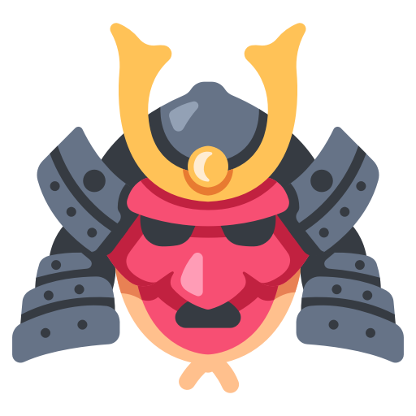

<p align="center">
    
</p>

<h1 align="center">🔴 maestriam/samurai</h1>

<p align="center">
  Create awsome themes for your Laravel projects.
</p>
<br>
<span align="center">


[](https://scrutinizer-ci.com/g/maestriam/samurai/?branch=master)


</span>


**Maestriam/Samurai** is a simple package for creating and managing themes for Laravel applications, using [component](https://laravel.com/docs/5.8/blade#components-and-slots) and [include](https://laravel.com/docs/5.8/blade#including-sub-views) functions of Laravel Blade.  
You can publishing your themes and install-it in another projects using composer.  

## Requirements

- Laravel 8.*^ 

## Installation

**Install via composer**
``` bash
composer require maestriam/samurai
```

**Publish samurai.php into config folder**
``` bash
php artisan vendor:publish --tag=Samurai
```

## Getting Started

To create a new theme
``` bash
php artisan samurai:make-init
```

**Creating a new theme with default configs**
``` bash
php artisan samurai:make-theme my-vendor/my-theme
```

**Creating a new include**   
``` bash
php artisan samurai:make-include my-include my-vendor/my-theme 
```
The `theme` param is optional. If not informed, assume the default theme automatically.  
To edit your include file, go to themes/my-vendor/my-theme/src/my-include/my-include-include.blade.php

**Creating a new component**  
``` bash
php artisan samurai:make-component my-component my-vendor/my-theme
```
The `theme` param is optional. If not informed, assume the default theme automatically.   
To edit your include file, go to themes/my-vendor/my-theme/src/my-component/my-component-component.blade.php

**Using theme in your project**  
To publish your assets and define your theme as current:
``` bash
php artisan samurai:use my-vendor/my-theme
```

**Using components into blade files**  
To use component in your view.blade.php, use:
``` bash
@myComponent()

    My content inside

@endmyComponent()
```

**Using includes into blade files**  
To use include in your view.blade.php, use:
``` bash
@myInclude()
```

**Load assets into theme files**  
To import any file into your theme(like css, js, imgs), use directive @public.  
E.g:
``` bash
<script src="@public('js/index.js')" />
```  
<br></br>  
Created by [Giuliano Sampaio](https://github.com/giusampaio) with ❤️, ☕ and 🍺!
